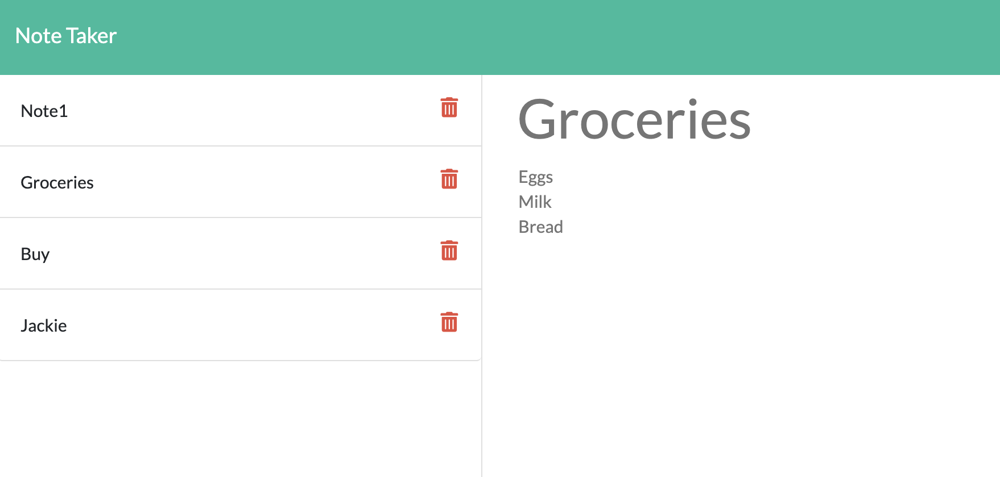

# H9-NOTE-TAKER

This application will allow you to take  your own notes, save them and delete them.  This application will use an express backend and save and retrieve note data from a JSON file.

## GettingStarted

Project Location

>[Project's GitHub repository](https://github.com/crisdc88/H9-NOTE-TAKER)

## Built With

* Node js
* HTML
* JavaScript
* Node Js
* Express

## Deployed Link

>[DeployedLink](https://ct-notetaker.herokuapp.com/)

## Installation

 To run this application on your local machine follow these steps:

1. Clone project from github.
2. On the terminal go to the project's path
3. run npm install
4. run node server.js
5. Open your browser and go to localhost:8080/

## Code-Snippets

Code sample.  This is a request call to read data from data base, making use of callback functions. 

```sh
 function getData(cb) {

        console.log("1.Reading Data")

        fs.readFile(dbpath, function (error, data) {
            if (error) throw error;
            // console.log("getting raw data")
            let txt = JSON.parse(data);
            // console.log(txt);
            cb(txt);
        })

    }

 app.get("/api/notes", function (req, res) {

        getData(function (data) {
            res.json(data);
        });

    })
```

## Screen shots

1. Console Input


2. HTML generated



3. GIF


## Author


D. Cristina Terry

GitHub: [https://github.com/crisdc88/](https://github.com/crisdc88/)

LinkedIn: [www.linkedin.com/in/dcristinaterry](www.linkedin.com/in/dcristinaterry)

## License


